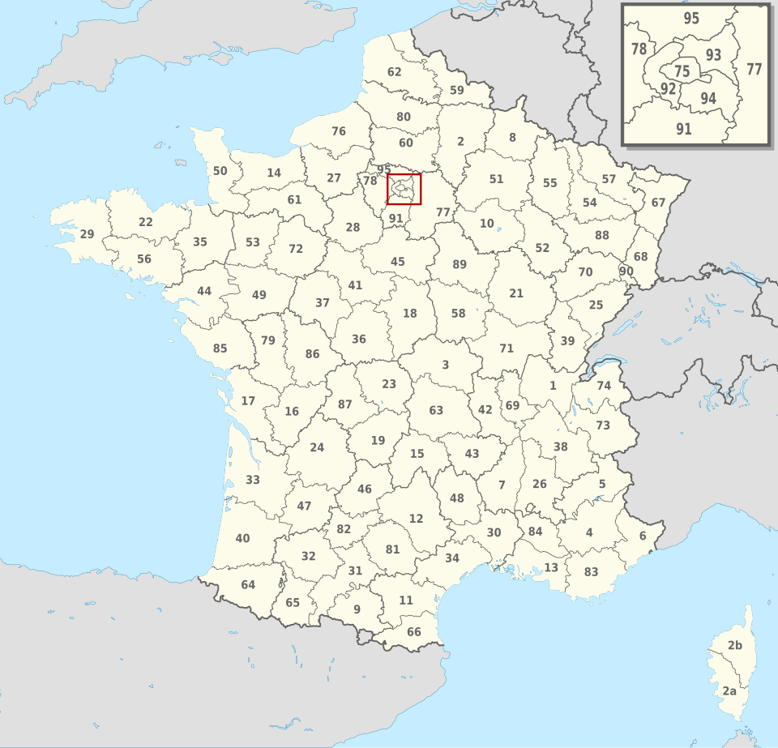
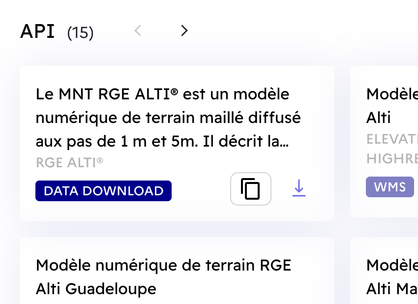
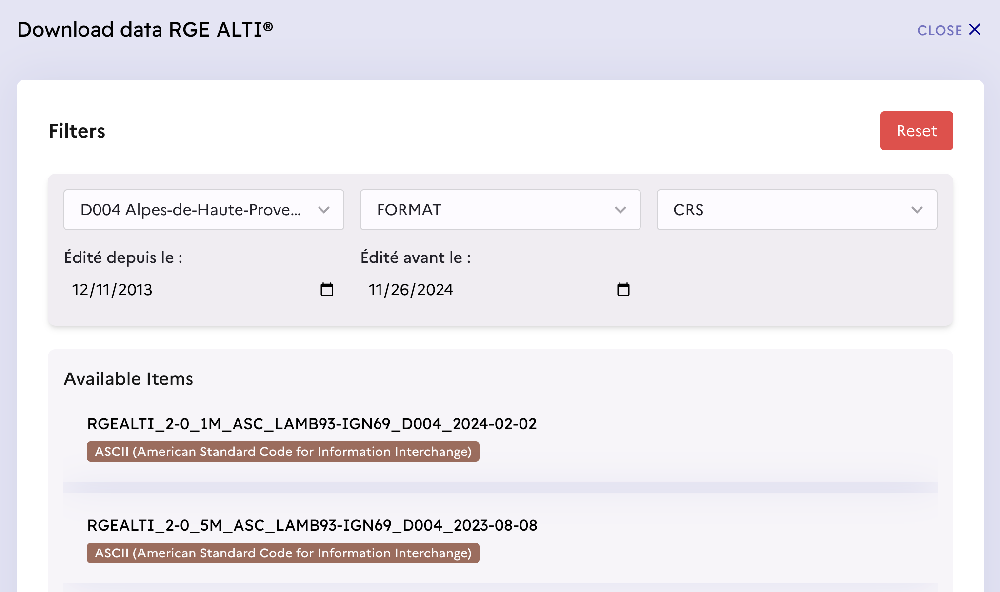
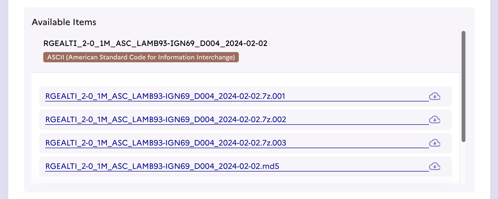
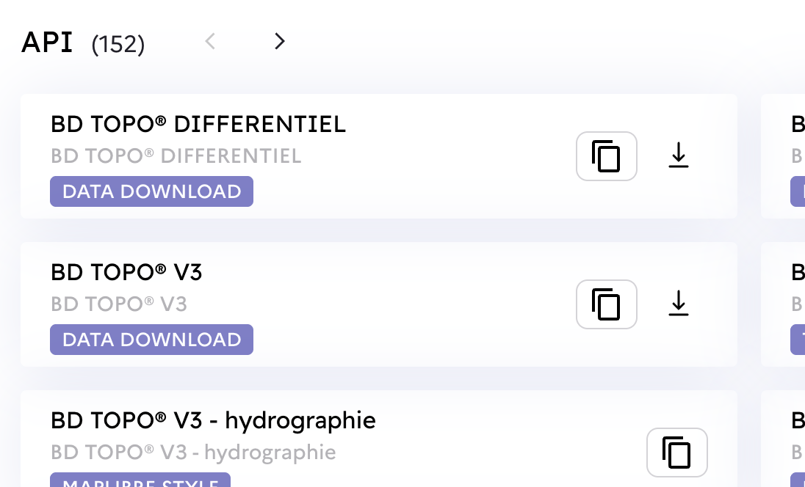
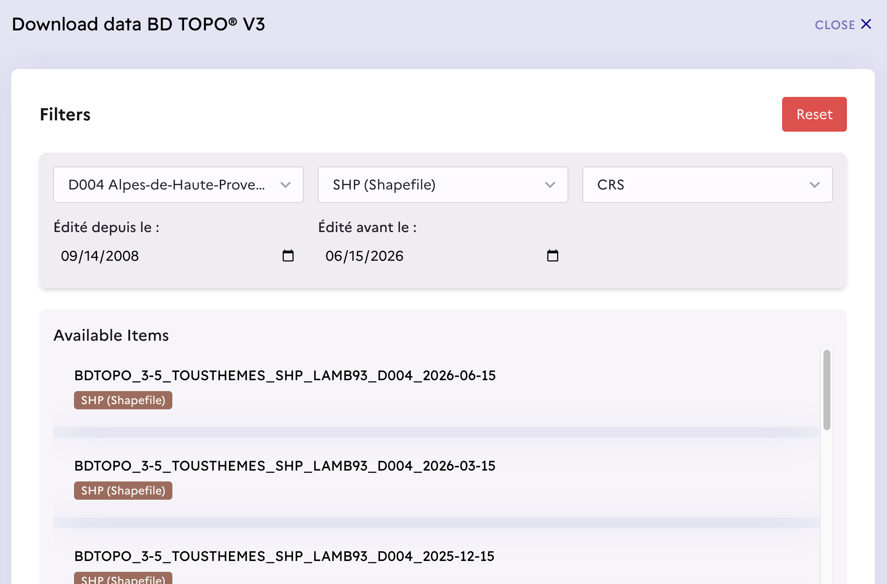
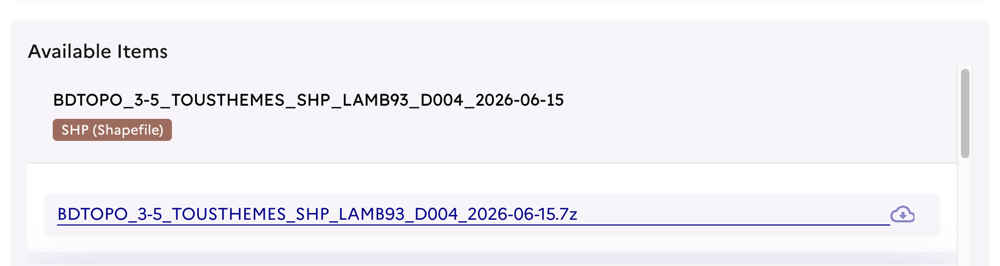

The French data should be downloaded into this directory and pre-processed as described here before you run the scripts.

* [RGE ALTI](#rge-alti)
* [BD TOPO](#bd-topo)
* [Pre-processing](#Pre-processing)

France is divided into 96 departments identified as D001 through D095 (with D020 Corsica being split into D02A and D02B). There are also a few overseas territories (like Guadeloupe and La Réunion) assigned values from D971 to D978.



(Image source: [Wikipedia](https://commons.wikimedia.org/wiki/File:France,_administrative_divisions_-_Nmbrs_(departments)_(Paris_zoom).svg))

The RGE ALTI and BD TOPO data follows this organization and you must choose which individual department you want to download data for.

To prevent this top level `data/` directory from being overwhelmed with individual files, each department should be downloaded into its own directory, for example, data for D075 (Paris) should be placed in `data/d075/`.

## RGE ALTI

RGE ALTI provides the Digital Elevation Models (DEM, or MNT = Modèle Numérique de Terrain) for all of France. The elevation data is recorded at regular intervals (1m or 5m).

RGE ALTI data can be downloaded from [cartes.gouv.fr](https://cartes.gouv.fr/rechercher-une-donnee/dataset/IGNF_RGE-ALTI). Scroll down on this page until you see the "MNT RGE ALTI" Data Download in the API section:



Click on the down arrow in that box to show the form to select which data set you want to download. This form will appear lower down on the same page, so you'll have to scroll down after clicking on the down arrow.

You should now see the Download Data form which has a few dropdown controls for filtering:



The first dropdown is labeled "ZONE" and this is where you select the department. In the image above, department D004 is selected. The other dropdowns are optional but can be set to FORMAT = ASCII and CRS = IGNF:LAMB93-IGN69 if you feel like it.

After selecting a zone, a set of "Available Items" will be shown. The names are encoded as follows:

```
RGEALTI_2-0_1M_ASC_LAMB93-IGN69_D004_2024-02-02
                                     ^^^^^^^^^^ Date
                                ^^^^ Department d004
                   ^^^^^^^^^^^^ Lambert93 IGN69 projection
               ^^^ ASCII encoded
            ^^ 1 meter (or 5 meter) DEM file
```

Clicking on one of these items will bring up the set of files that can be downloaded:



Large files are chunked into 4Gb files, so here you see the D004 data is in 3 parts. These need to be downloaded and concatenated into a single `.7z` file (unless your 7z extractor is clever enough to handle multi-part files directly).

The `.md5` file is optional and can be used to run a checksum on you downloaded (and concatenated) file to verify the data was downloaded properly.

## BD TOPO

BD TOPO provides shape files for buildings and other structures in France.

BD TOPO data can be downloaded from [cartes.gouv.fr](https://cartes.gouv.fr/rechercher-une-donnee/dataset/IGNF_BD-TOPO). Scroll down on this page until you see the "BD TOPO V3" Data Download in the API section:



As with the RGE ALTI data, click on the down arrow and scroll down to see the "Download data BD TOPO V3" form where you can filter the files to find the one you want.



Select the Zone you want (D004 shown above) and choose "SHP (Shapefile)" as the FORMAT. There is no need to choose a CRS.

The available items are encoded as follows:

```
BDTOPO_3-5_TOUSTHEMES_SHP_LAMB93_D004_2026-06-15
                                      ^^^^^^^^^^ Date
                                 ^^^^ Department d004
                          ^^^^^^ Lambert93 projection
                      ^^^ Shapefile
```

Clicking on this will show the list of files:



Data is compressed in `.7z` files, but since the data in the shapefiles is much smaller than the RGE ALTI DEM files, there isn't a need to split them into multiple files.

## Pre-processing

Python does not have native support for handling `.7z` files the way that it does for `.zip` files, so we can't use the downloaded files directly.

In order for these files to be used by the python scripts, we need to convert these `.7z` files into `.zip` files. The way to do this is by uncompressing the `.7z` files and then recompressing as `.zip` files.

You can use whatever tools you have available on your platform for this.
