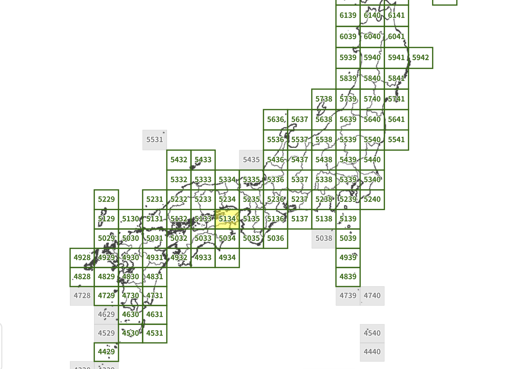
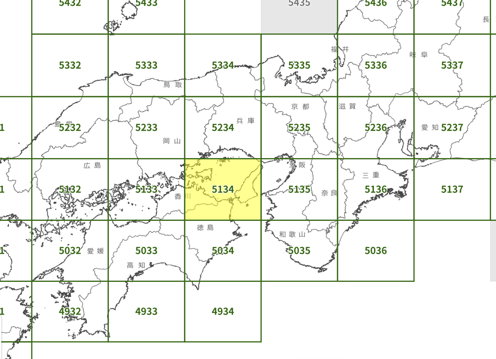
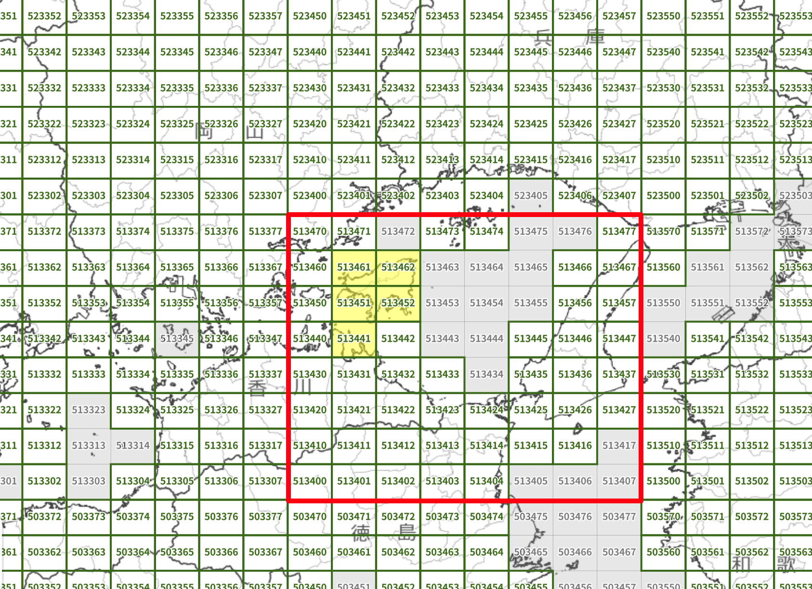
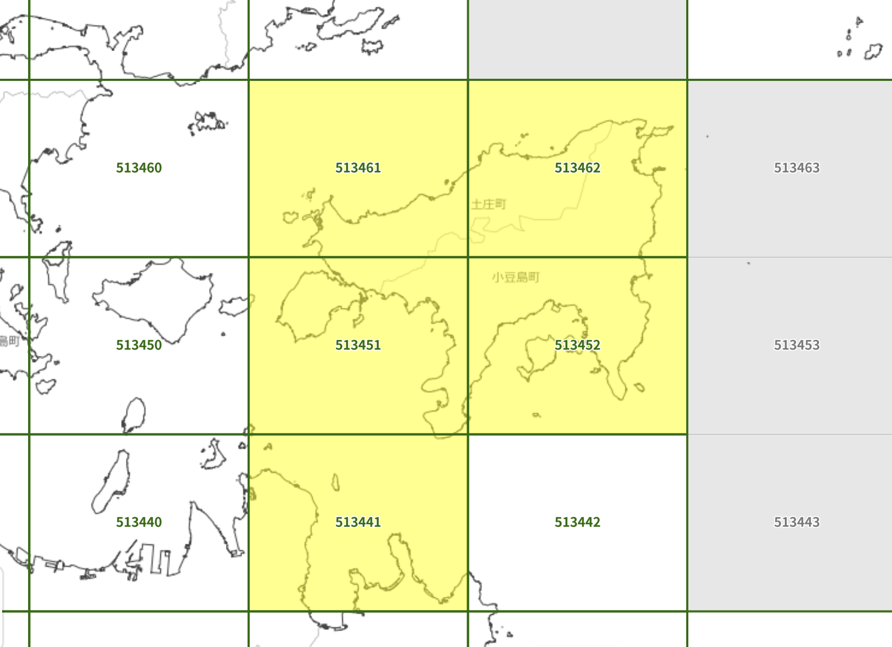
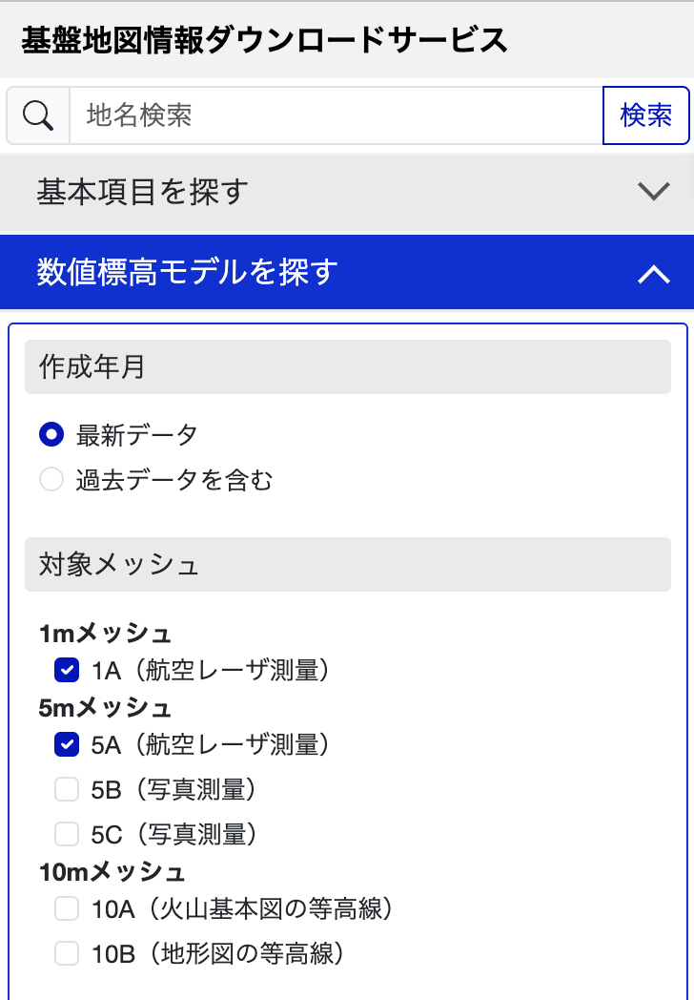

JPGIS data

Digital elevation data for Japan can be downloaded from the [service.gsi.go.jp](https://service.gsi.go.jp/kiban/app/map/?search=dem) site.

The country is divided into small meshes, each of which has an 8-digit id.



At first you see the top level sectors, identified by the first 4 digits of the mesh id.



Zooming in on the map will reveal that each of these is divided into 64 (8x8) smaller quadrants:



These quadrants (with the first 6 digits of the mesh id) are the basic unit that you can download. 



To see available data files, you need to select which kind of files you're interested in.



Here, both 1 meter and 5 meter meshes from aerial laser surveys are selected. The 5 meter meshes also have the option for photogrammetry data (5B and 5C), but this data is relatively sparse.

Each download will be a .zip file that contains up to 100 mesh files.

```
FG-GML-513451-DEM1A-20251208.zip
                    ^^^^^^^^ file date
              ^^^^^ resolution (DEM1A or DEM5A)
       ^^^^^^ mesh id prefix (6-digits)
```

Each mesh is stored in a separate .xml file:

```
FG-GML-5134-51-09-DEM1A-20251208.xml
       ^^^^ ^^ ^^ 8-digit mesh id
```


